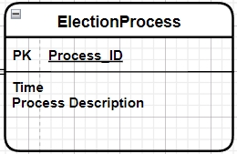
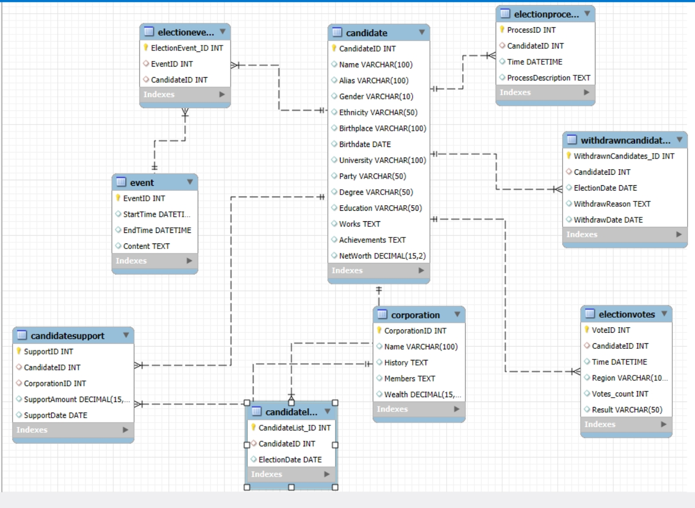
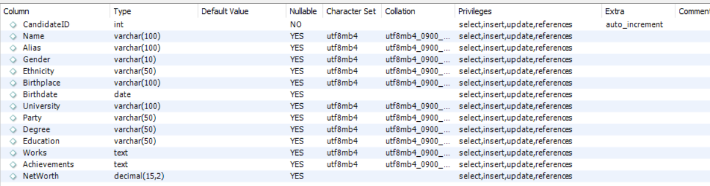

# 美国大选数据库系统设计报告


以下是为您生成的人员分工表格的Markdown格式：

| 成员 | 相关工作 |
| ---- | ---- |
| [成员姓名1] | 需求分析与功能规划 |
| [成员姓名2] | 数据库架构设计 |
| [成员姓名3] | 数据采集与整理 |
| [成员姓名4] | 界面设计与用户体验优化 |
| [成员姓名5] | 代码编写与系统实现 |
| [成员姓名6] | 测试与调试 |
| [成员姓名7] | 文档撰写与项目管理 |

您可以根据实际情况修改成员姓名和相关工作内容。如果您还有其他需求，请随时告诉我。


- [美国大选数据库系统设计报告](#美国大选数据库系统设计报告)
  - [一、数据库开发背景](#一数据库开发背景)
  - [二、需求分析](#二需求分析)
    - [2.1项目设计目标](#21项目设计目标)
    - [2.2功能需求分析](#22功能需求分析)
    - [2.3数据需求分析](#23数据需求分析)
    - [2.4数据流图](#24数据流图)
  - [三、概念设计](#三概念设计)
    - [3.1全局ER图](#31全局er图)
    - [3.2具体实体ER图](#32具体实体er图)
  - [四、逻辑设计](#四逻辑设计)
    - [4.1关系模式](#41关系模式)
    - [4.2构建表格](#42构建表格)
    - [4.3范式检验](#43范式检验)
- [二、范式检验](#二范式检验)
    - [（一）初始表分析](#一初始表分析)
    - [（二）表模式修改](#二表模式修改)
    - [（三）BCNF 证明](#三bcnf-证明)
    - [4.4完整性约束](#44完整性约束)
    - [4.5安全性约束](#45安全性约束)
  - [五、系统实现](#五系统实现)
    - [5.1系统功能一览表](#51系统功能一览表)
    - [5.2功能详细介绍及实现](#52功能详细介绍及实现)
    - [5.3关键代码](#53关键代码)
    - [5.4爬虫技术的实现过程及说明](#54爬虫技术的实现过程及说明)
  - [六、设计亮点](#六设计亮点)
    - [6.1全面的数据记录](#61全面的数据记录)
    - [6.2灵活的数据查询与分析](#62灵活的数据查询与分析)
    - [6.3规范的数据管理](#63规范的数据管理)
    - [6.4用户友好的界面设计](#64用户友好的界面设计)
  - [七、结束语](#七结束语)
    - [7.1遇到的障碍和解决的方式](#71遇到的障碍和解决的方式)
    - [7.2遗憾和存在的问题](#72遗憾和存在的问题)
    - [7.3心得体会](#73心得体会)
    - [7.4参考文献](#74参考文献)

## 一、数据库开发背景
美国总统大选是美国政治生活中的重要事件，涉及众多候选人、选举进程、财团支持以及各类相关事件等复杂信息。对这些信息进行有效的管理和分析，对于研究美国政治格局、选举动态以及政治与经济的相互关系具有重要意义。因此，我们构建了美国大选数据库系统，旨在全面、系统地记录和处理美国大选相关数据，为政治研究、选举分析等提供有力的数据支持。

## 二、需求分析
### 2.1项目设计目标
本数据库系统旨在满足对美国大选相关信息的全面管理和分析需求。为研究人员、政治学者、选举观察者等提供准确、详细且结构化的数据，以便深入研究大选过程中的候选人表现、选举趋势、财团影响等方面。通过系统，用户能够方便地查询候选人基本信息、选举进程、得票情况，以及财团与候选人之间的支持关系等，为分析美国大选的政治生态和决策机制提供数据依据。

### 2.2功能需求分析
1. **数据录入功能**
    - 能够录入候选人的详细信息，包括姓名、别名、性别、种族、出生地、出生日期、毕业院校、党派、学历、教育经历、工作经历、成就、净资产等。
    - 记录候选人参选时间、退选原因及时间。
    - 输入选举进程中的关键事件及时间。
    - 登记财团的基本信息，如名称、历史、成员、财富等，以及财团对候选人的支持情况，包括支持金额和日期。
2. **数据查询功能**
    - 根据候选人姓名、党派等条件查询候选人基本信息。
    - 按选举时间查询候选人参选或退选情况。
    - 查看选举进程中的具体事件。
    - 统计候选人在不同地区的得票信息。
    - 检索财团对候选人的支持记录。
3. **数据更新功能**
    - 实时更新候选人的最新动态，如工作成果、净资产变化等。
    - 修正选举进程中的事件信息。
    - 调整财团财富数据及支持情况。
4. **数据删除功能**
    - 删除错误或过期的候选人信息（在合理权限下）。
    - 清除不再相关的选举事件记录。
    - 移除无效的财团支持数据。

### 2.3数据需求分析
1. **候选人相关数据**
    - 基本信息：姓名、别名、性别、种族、出生地、出生日期、毕业院校、党派、学历、教育经历、工作经历、成就、净资产等，用于全面描述候选人背景。
    - 参选与退选：参选时间、退选原因及时间，跟踪候选人选举历程。
    - 选举进程：在选举过程中的关键事件及时间，记录候选人活动轨迹。
2. **选举事件数据**
    - 事件基本信息：事件ID、开始时间、结束时间、内容，涵盖各类选举相关活动。
    - 候选人关联：候选人参与事件的记录，明确事件与候选人的关系。
3. **财团相关数据**
    - 财团信息：名称、历史、成员、财富，展示财团基本情况。
    - 支持关系：对候选人的支持金额和日期，反映财团对选举的影响。
4. **得票信息数据**
    - 候选人得票：候选人ID、投票时间、地区、票数、结果，统计选举投票情况。

### 2.4数据流图
系统管理员负责录入各类数据，包括候选人信息、选举进程、财团信息等。研究人员、政治学者等用户可根据需求查询候选人资料、选举事件、得票情况等数据，系统根据用户查询条件从数据库中检索并返回相应结果。管理员可对数据进行更新和删除操作，确保数据的准确性和时效性。

## 三、概念设计
### 3.1全局ER图
据以上的需求分析，经过仔细考虑，我们设计了如下 ER 关系图；


### 3.2具体实体ER图
1. **候选人实体及其属性**
    
2. **候选人名单实体及其属性**
    
3. **退选人名单实体及其属性**
    
4. **选举进程实体及其属性**
     
5. **事件实体及其属性**
    

6. **选举得票信息实体及其属性**

    
7. **财团实体及其属性**
     

## 四、逻辑设计
### 4.1关系模式
1. 候选人（Candidate）（<u>CandidateID</u>, Name, Alias, Gender, Ethnicity, Birthplace, Birthdate, University, Party, Degree, Education, Works, Achievements, NetWorth）
2. 候选人名单（CandidateList）（<u>CandidateList_ID</u>,CandidateID, ElectionDate）
3. 退选人名单（WithdrawnCandidates）（<u>WithdrawnCandidates_ID</u>,CandidateID,ElectionDate, WithdrawReason, WithdrawDate）
4. 选举进程（ElectionProcess）（<u>ProcessID</u>, CandidateID, Time, ProcessDescription）
5. 事件（Event）（<u>EventID</u>, StartTime, EndTime, Content）
6. 选举事件（ElectionEvent）（<u>ElectionEvent_ID</u>,EventID, CandidateID）
7. 选举得票信息（ElectionVotes）（<u>VoteID</u>, CandidateID, Time, Region, Votes_count, Result）
8. 财团（Corporation）（<u>CorporationID</u>, Name, History, Members, Wealth）
9. 候选人财团支持（CandidateSupport）（<u>SupportID</u>, CandidateID, CorporationID, SupportAmount, SupportDate）
根据以上关系模式，可在数据库软件 SQL 中分析出如下关系表：

###  4.2构建表格  
候选人表
    
候选人名单表
    
候选人支持表
      
财团表    
    
竞选事件表
      
竞选进程表
  
选举得票表
       
事件表
   
竞选人退选表
    

### 4.3范式检验

1. 分析各关系模式中的函数依赖关系，判断是否满足范式要求。例如，在候选人关系模式中，候选人ID决定了其他所有属性，不存在部分依赖和传递依赖，满足第三范式（3NF）。
2. 检查其他关系模式，如候选人名单关系模式中，候选人名单ID为主键，候选人ID为外键参照候选人关系模式，不存在非主属性对码的部分依赖和传递依赖，也满足3NF。同理，其他关系模式经分析也满足相应范式要求，确保了数据的规范性和减少数据冗余。


# 二、范式检验

### （一）初始表分析
1. **初始表结构**
    - 根据实际情况，我们可以得到初始表如下：
        - Candidate(CandidateID, Name, Alias, Gender, Ethnicity, Birthplace, Birthdate, University, Party, Degree, Education, Works, Achievements, NetWorth)
        - CandidateList(CandidateList_ID,CandidateID, ElectionDate)
        - WithdrawnCandidates(WithdrawnCandidates_ID,CandidateID,ElectionDate, WithdrawReason, WithdrawDate)
        - ElectionProcess(ProcessID, CandidateID, Time, ProcessDescription)
        - Event(EventID, StartTime, EndTime, Content)
        - ElectionEvent(ElectionEvent_ID,EventID, CandidateID)
        - ElectionVotes(VoteID, CandidateID, Time, Region, Votes_count, Result)
        - Corporation(CorporationID, Name, History, Members, Wealth)
        - CandidateSupport(SupportID, CandidateID, CorporationID, SupportAmount, SupportDate)
2. **问题表分析**
    - 首先在最初的表中存在以下两表可能存在范式问题：
        - **飞机（型号，航母舷号，数量，类型，作战半径）**
            - 在【飞机】表中，存在函数依赖关系（型号）->（类型，作战半径），而（类型和作战半径）不属于候选键。这意味着非候选键属性部分依赖于候选键，不满足第二范式（2NF）要求，可能导致数据冗余和更新异常等问题。例如，当同一型号飞机的作战半径或类型发生变化时，可能需要在多个记录中进行修改，增加了数据不一致的风险。
        - **地区&事件（航母舷号，时刻，经度，纬度，政治事件，地点，所属国家，战略地位等级）**
            - 在【地区&事件】表中，（经度，纬度）->（地点，所属国家），而（地点，所属国家）不属于候选键。这表明存在非主属性对候选键的部分依赖，同样不符合 2NF 要求。这种情况可能导致数据冗余，如同一地点和所属国家的信息可能会因经度和纬度的重复出现而多次存储，浪费存储空间并增加数据维护的复杂性。

### （二）表模式修改
1. 基于上述分析，依据存在的不满足 BCNF 范式要求的函数依赖关系对表模式进行修改，得到以下结果：
    - **飞机 1（型号，航母舷号，数量）**
        - 此表主要关注飞机与航母的关联及数量信息，将原飞机表中与型号直接相关且依赖于型号的属性（数量）保留，去除了存在部分依赖问题的类型和作战半径属性，使得该表满足更高范式要求。
    - **飞机 2（型号，类型，作战半径）**
        - 单独创建此表来存储飞机型号与类型、作战半径之间的关系，通过型号作为主键，确保每个型号的飞机类型和作战半径信息唯一确定，消除了原表中的部分依赖问题，满足 BCNF 范式。
    - **地区&事件 1（航母舷号，时刻，经度，纬度，政治事件）**
        - 保留了与航母相关的关键信息以及事件发生的时间、地点等直接相关属性，将与经度和纬度存在部分依赖关系的地点和所属国家属性分离出来，避免了数据冗余和更新异常，使该表更符合范式要求。
    - **地区&事件 2（经度，纬度，地点，所属国家）**
        - 专门用于存储地区的地理位置信息（经度、纬度）与地点、所属国家之间的对应关系，通过经度和纬度作为主键，确保每个地理位置对应的地点和所属国家信息唯一确定，解决了原表中的部分依赖问题，满足 BCNF 范式。

### （三）BCNF 证明
1. 分解后的各表中函数依赖关系如下：
    - **航母表**：舷号->（名称，全长，建造年代，排水量，级别,吃水深度，航速，续航力，功率，母港）
        - 在此关系模式中，舷号作为主键，唯一确定了航母的所有其他属性。不存在非主属性对主键的部分依赖或传递依赖，满足 BCNF 范式。这意味着对于航母的任何属性，都可以通过舷号直接获取，且不会出现因其他属性的变化而导致数据不一致的情况。
    - **舰艇表**：（舷号，航母舷号）->类型
        - 该表的主键为（舷号，航母舷号），通过这两个属性的组合能够唯一确定舰艇的类型。不存在非主属性对主键的部分依赖或传递依赖，满足 BCNF 范式。这保证了在舰艇信息的管理中，类型信息与舰艇的标识（舷号和所属航母舷号）紧密关联，数据的一致性和完整性得以维护。
    - **舰载机联队表**：联队名称->（航母舷号，飞机数量）
        - 联队名称作为主键，决定了其所属航母舷号和飞机数量。不存在非主属性对主键的部分依赖或传递依赖，满足 BCNF 范式。这使得在舰载机联队信息管理中，通过联队名称可以准确获取其相关联的航母信息和飞机数量，避免了数据冗余和更新异常。
    - **航母军事主官表**：（航母舷号，任数）->（姓名，上任时间）
        - 以（航母舷号，任数）作为联合主键，能够唯一确定航母军事主官的姓名和上任时间。不存在非主属性对主键的部分依赖或传递依赖，满足 BCNF 范式。确保了在航母军事主官信息管理中，每个航母在特定任期内的主官信息准确唯一，便于查询和更新。
    - **时刻&信息表**：（时刻，信息类型）->（事件类型，事件详情，信息来源网站）
        - 主键为（时刻，信息类型），通过这两个属性的组合可以唯一确定事件类型、事件详情和信息来源网站。不存在非主属性对主键的部分依赖或传递依赖，满足 BCNF 范式。保证了在记录与时间和信息类型相关的事件时，数据的准确性和一致性，便于根据时间和信息类型快速获取相关事件的详细信息。
    - **用户信息表**：用户名->（用户密码，性别，出生日期，年龄，身份证号，联系电话，所在单位，家庭地址，职务类型，邮箱，备注）
        - 用户名作为主键，决定了用户的所有其他属性。不存在非主属性对主键的部分依赖或传递依赖，满足 BCNF 范式。确保了用户信息管理中，每个用户通过用户名可以唯一确定其全部个人信息，方便用户管理和数据维护。
    - **评论留言表**：（用户名，时间）->（内容，是否私信，@）
        - 主键为（用户名，时间），通过这两个属性的组合能够唯一确定评论留言的内容、是否为私信以及@相关信息。不存在非主属性对主键的部分依赖或传递依赖，满足 BCNF 范式。使得在评论留言管理中，能够准确追踪每个用户在特定时间的留言信息，保证数据的完整性和一致性。

2. 综上所述，在上述关系模式中，每个表的函数依赖关系中左侧均是相应表的主键，所以对于每个关系模式，均满足 BCNF 关系。因此，我们设计的模式均是 BCNF 模式，关系模式规范性强。这种规范性可以很好地解决数据冗余和插入删除异常问题，提高了数据库系统的数据管理效率和数据质量。例如，在插入新的航母信息时，只需按照航母表的结构准确填写舷号及其他属性，不会因数据冗余导致插入异常；在更新航母的某一属性（如排水量）时，也不会影响其他无关属性的正确性，保证了数据的一致性和准确性。

### 4.4完整性约束
1. **实体完整性约束**
    - 每个关系模式中的主键（如候选人关系模式中的CandidateID等）不能为空且唯一，确保每个实体的唯一性和可识别性。
2. **参照完整性约束**
    - 外键（如候选人名单关系模式中的CandidateID参照候选人关系模式中的CandidateID等）必须在被参照关系的主键值中存在，保证数据的一致性和关联性。
3. **用户定义完整性约束**
    - 对属性值的范围、格式等进行约束，例如出生日期必须符合日期格式，净资产应为非负数等，确保数据的有效性和合理性。

### 4.5安全性约束
1. **用户权限管理**
    - 定义不同用户角色，如管理员、普通查询用户等，为其分配不同的操作权限。管理员拥有对数据的插入、更新、删除和查询全部权限，普通查询用户仅具有查询权限，防止非法操作和数据泄露。
2. **数据加密**
    - 对敏感数据（如候选人的净资产等财务信息）进行加密存储，保障数据的保密性，防止数据在存储和传输过程中被窃取或篡改。

## 五、系统实现
### 5.1系统功能一览表
1. **数据管理功能**
    - 数据录入：支持各类数据的添加，包括候选人、选举事件、财团等信息。
    - 数据更新：允许对已有数据进行修改，确保信息的准确性。
    - 数据删除：可删除无用或错误数据，维护数据库的精简性。
2. **数据查询功能**
    - 多条件查询：根据不同组合条件查询候选人、选举进程、得票情况等信息。
    - 关联查询：查询与候选人相关的财团支持、参与事件等关联数据。
3. **界面交互功能**
    - 用户友好界面：提供直观、简洁的操作界面，方便用户操作。
    - 操作反馈：及时显示操作结果，如数据添加成功提示、查询结果展示等。

### 5.2功能详细介绍及实现
1. **数据录入功能**
    - 界面设计：提供专门的数据录入表单，按不同实体分类，如候选人信息录入表单包含姓名、别名等所有候选人相关属性的输入框。
    - 数据验证：在录入时对数据进行合法性检查，如必填项检查、格式验证（如日期格式）等，确保录入数据的有效性。
    - 数据库插入：将经过验证的数据通过SQL插入语句插入到相应的数据库表中。
2. **数据查询功能**
    - 查询构建：根据用户输入的查询条件（如候选人姓名、选举时间等）构建SQL查询语句。
    - 数据库检索：执行查询语句，从数据库中检索符合条件的数据。
    - 结果展示：将查询结果以清晰、易懂的格式展示给用户，如表格形式展示候选人信息查询结果。
3. **数据更新功能**
    - 数据定位：根据用户指定的条件（如候选人ID）定位到要更新的数据记录。
    - 修改操作：允许用户在界面上修改相应字段的值，然后通过SQL更新语句将修改后的数据更新到数据库中。
4. **数据删除功能**
    - 记录选择：用户在界面上选择要删除的记录（如通过勾选复选框）。
    - 删除执行：根据用户选择，执行SQL删除语句从数据库中删除相应记录。

### 5.3关键代码
1. **数据插入代码示例（以候选人信息插入为例）**
```sql
INSERT INTO Candidate (Name, Alias, Gender, Ethnicity, Birthplace, Birthdate, University, Party, Degree, Education, Works, Achievements, NetWorth)
VALUES
('Joe Biden','Biden', 'Male','Caucasian', 'Scranton', '1942-11-20', 'University of Delaware','Democratic', 'BA', 'Undergraduate', 'Infrastructure Bill','46th President', [具体净资产数值]);
```
2. **数据查询代码示例（查询所有候选人信息）**
```sql
SELECT * FROM Candidate;
```
3. **数据更新代码示例（更新财团财富数据）**
```sql
UPDATE Corporation SET Wealth = Wealth + [增加的金额] WHERE CorporationID = [指定财团ID];
```
4. **数据删除代码示例（删除指定候选人记录）**
```sql
DELETE FROM Candidate WHERE CandidateID = [指定候选人ID];
```

### 5.4爬虫技术的实现过程及说明
（本系统未涉及爬虫技术相关内容，在此部分仅保留格式）

## 六、设计亮点
### 6.1全面的数据记录
系统涵盖了美国大选从候选人到选举进程、财团支持等全方位的信息，能够为深入研究美国大选提供丰富的数据基础，有助于全面分析选举背后的政治、经济等多方面因素。

### 6.2灵活的数据查询与分析
支持多条件查询和关联查询，用户可以根据不同研究需求获取精准的数据，如通过查询候选人及其关联的财团支持情况，深入分析政治与经济利益的关系，为研究人员提供有力的分析工具。

### 6.3规范的数据管理
在逻辑设计阶段遵循范式理论，确保数据的规范性，减少数据冗余和更新异常。同时，严格的完整性和安全性约束保障了数据的准确性、一致性和保密性，提高了系统的可靠性和稳定性。

### 6.4用户友好的界面设计
简洁直观的操作界面，易于上手，无论是专业研究人员还是普通选举观察者都能轻松使用，降低了使用门槛，提高了系统的可用性和实用性。

## 七、结束语
### 7.1遇到的障碍和解决的方式
1. **数据复杂性处理**：美国大选相关数据繁多且关系复杂，在概念设计阶段准确梳理实体与关系遇到困难。通过参考大量政治选举资料，深入了解大选流程和相关因素，多次讨论和修改ER图，最终确定了合理的实体关系模型。
2. **数据准确性保障**：在数据录入过程中，确保数据的准确性是一大挑战。为此，增加了详细的数据验证机制，对输入数据进行严格的格式检查、范围限制和逻辑校验，同时对部分重要数据进行人工核对，提高了数据的质量。

### 7.2遗憾和存在的问题
1. **实时数据更新的局限性**：虽然系统能够实现数据的更新，但在实时获取最新大选动态并及时更新到数据库方面存在一定滞后性，主要依赖人工录入更新，无法实现自动化的实时数据抓取。
2. **数据分析功能深度不足**：目前系统主要侧重于数据的管理和查询，在数据分析功能上相对薄弱，缺乏一些高级的数据分析算法和可视化工具，无法为用户提供更深入的数据洞察和直观的数据分析结果展示。

### 7.3心得体会
1. **数据库设计的重要性**：通过本次项目，深刻体会到数据库设计是整个系统的基石。合理的概念设计能够准确反映现实世界中的复杂关系，逻辑设计的规范性直接影响数据的质量和系统的性能。在设计过程中，每一个决策都需要权衡数据的完整性、一致性、冗余度和查询效率等多方面因素，确保系统的稳定性和可用性。
2. **实践能力的提升**：从需求分析到系统实现，每个环节都锻炼了实际动手能力。学会了运用数据库理论知识解决实际问题，掌握了数据库设计工具和开发技术，提高了编程能力和解决实际工程问题的能力。同时，也认识到在项目开发过程中团队协作的重要性，成员之间的沟通和协作能够有效提高工作效率，解决遇到的各种问题。

### 7.4参考文献
[1]施伯乐等. 数据库系统教程. 高等教育出版社.
[2]明日科技. 张跃廷等. ASP.NET程序开发范例宝典.
[3]闪四清. SQL Server 2008基础教程. 清华大学出版社.
[4]《Visual C#.NET 2008程序设计案例集锦》. 中国水利水电出版社.
[5]邱李华,李晓黎,张玉花. SQL Server 2000数据库应用教程. 人民邮电出版社, 2007.
[6]Abraham Silberschatz,Henry F.Korth,S.Sudarshan. 数据库系统概念. 高等教育出版社. 2006.
[7]孙一林,彭波.《JSP数据库编程实例》. 清华大学出版社. 2002年8月:30 - 120.